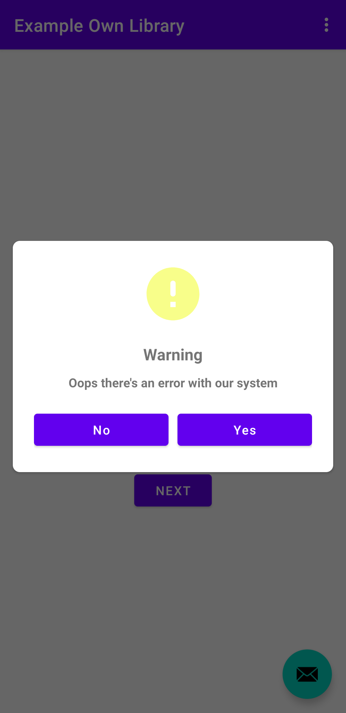

#Dialogue
##an custom dialog with custom action and icon
## Screenshoot

## How to use ?
### implementation 'com.github.jemmycalak:Dialogue:0.0.2'
### in build.gradle:
buildFeatures {
    dataBinding true
}
### and:
allprojects {
    repositories {
        google()
        jcenter()
        maven { url 'https://jitpack.io' }
    }
}

### call in the dialog
Dialogue(DialogueModel(
    R.drawable.ic_icon,
    "Warning",
    "Oops there's an error with our system",
    "Yes",
    "No",
    {},
    {}
)).show(supportFragmentManager, TAG)